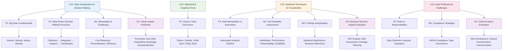

```mermaid
graph TD
    A[LO1: Data Visualization for Decision Making] --> A1[P1: Big Data Fundamentals]
    A --> A2[P2: Data-Driven Decision Making Processes]
    A --> A3[M1: Advantages & Challenges]
    A --> A4[D1: Future Impact Prediction]
    
    B[LO2: Statistical & Graphical Tools] --> B1[P3: Industry Tools Discussion]
    
    C[LO3: Statistical Techniques for Visualization] --> C1[P4: Data Manipulation & Automation]
    C --> C2[M2: Tool Suitability Assessment]
    C --> C3[M3: Findings Interpretation]
    C --> C4[D2: Business Decision Impact Evaluation]
    
    D[LO4: Data Professional Challenges] --> D1[P5: Roles & Responsibilities]
    D --> D2[M4: Compliance Strategies]
    D --> D3[D3: Cultural Impact Evaluation]
    
    A1 --> E[Volume, Velocity, Variety, Veracity]
    A2 --> F[Collection → Integration → Analysis → Visualization]
    A3 --> G[Cost Reduction, Personalization, Efficiency]
    A4 --> H[Preventive Care Shift, Competitive Advantage, Societal Benefits]
    
    B1 --> I[Python, Pandas, Scikit-learn, Plotly, Dash]
    
    C1 --> J[Automated Analysis Pipeline]
    C2 --> K[Justification: Performance, Interpretability, Scalability]
    C3 --> L[Statistical Significance, Business Relevance]
    C4 --> M[ROI Analysis, Risk Assessment, Strategic Planning]
    
    D1 --> N[Data Scientists, Analysts, Engineers]
    D2 --> O[HIPAA Compliance, Data Governance]
    D3 --> P[Skill Development, Cultural Transformation, Communication]
    
    style A fill:#e3f2fd
    style B fill:#e8f5e8
    style C fill:#fff3e0
    style D fill:#fce4ec
    style A4 fill:#f3e5f5
    style C4 fill:#f3e5f5
    style D3 fill:#f3e5f5
```